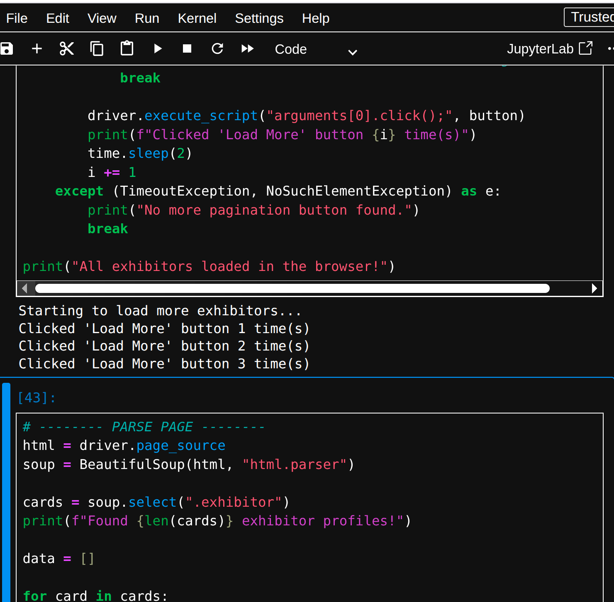
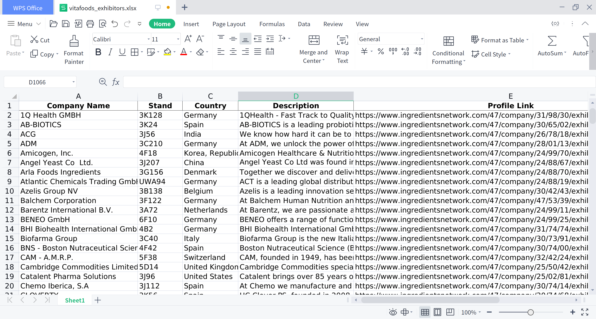

# Vitafoods Exhibitor Scraper

This project is a Python web scraper that collects exhibitor information from the Vitafoods exhibitor directory.

The script automatically loads all exhibitors by clicking the "Show More Results" button and extracts company details.

## Features

- Automated pagination using Selenium
- Handles dynamic website content
- Extracts exhibitor information
- Saves structured dataset to Excel

## Technologies Used

- Python
- Selenium
- BeautifulSoup
- Pandas

## Data Collected

The scraper extracts:

- Company Name
- Stand
- Hall
- Country
- Description
- Profile Link

## Installation

Clone the repository:

```
git clone https://github.com/sabik-hub/vitafoods-exhibitor-scraper.git
```

Install dependencies:

```
pip install -r requirements.txt
```

Run the scraper:

```
python scraper.py
```

## Output

The script generates the following dataset:

```
vitafoods_exhibitors.xlsx
```

## Example Output

### Scraper Running



### Excel Dataset



## Disclaimer

This project is created for educational purposes.
